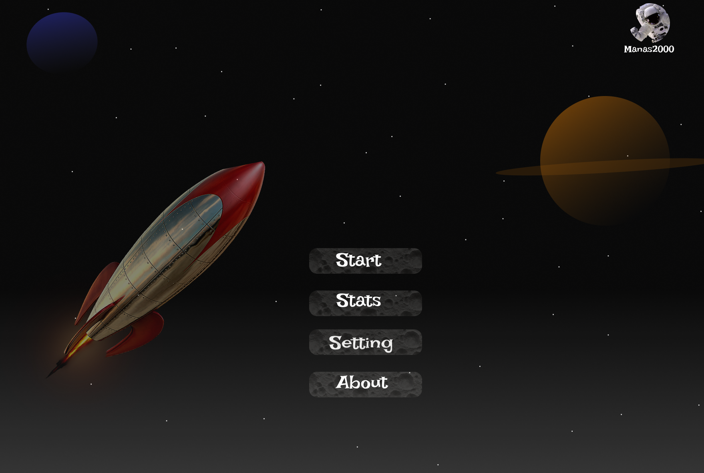

# [AttackOnUranus](https://github.com/manaspz/AttackOnUranus)
> Under Development 🚧👷‍♂️

An old classic game implementation using pygame.
The name inspiration from the mini-game on open world player [GTA-SanAndreas](https://gta.fandom.com/wiki/They_Crawled_from_Uranus) 

## The Game concept and notes:
> 1.Aug.2023 - This project is again in construction after being abandoned.

Features : 
- High Score, difficulty levels 
- Pause/Play 
- Background music

## Concept Art 

<figure class="video_container">
  <video controls="true" allowfullscreen="true" poster="">
    <source src="assets/readme/cast/demo.mp4" type="video/mp4">
  </video>
</figure>

## Usage
> Under Development 🚧👷‍♂️

## Dev Updates Tracker
> :construction_worker_man: DEVELOPMENTS AHEAD
- [x] v0.1 - Figma File / Game vision
- [ ] v0.2 - Game menu 
- [ ] v0.3 - Settings and rendering
  - [ ] v0.3.3 - Game Assets : player, enemies, background (arena) 
  - [ ] v0.3.6 - Background music
- [ ] v0.4 - Credits page
- [ ] v0.5 - Main Game modules
  - [ ] v0.5.3 - Player  
  - [ ] v0.5.6 - Enemies
  - [ ] v0.5.9 - Score system
- [ ] v0.6 - Play/Pause game events
- [ ] v0.7 - Pre test

## Purpose ?
- UI/UX development
- Programming practice

### Tech Stack 
> Python3.2, PyGame 

This is a Hobby Project meant for educational purposes and not meant for commercial usage. 
See the LICENSE file for licensing details and copyright.

Project Owner : [Manas](mailto:reach_manas@outlook.com)

## List of Contributors
- Artwork : [Anjali](https://github.com/anjalidasuni)
- Code : [Manas](https://github.com/manaspz)

